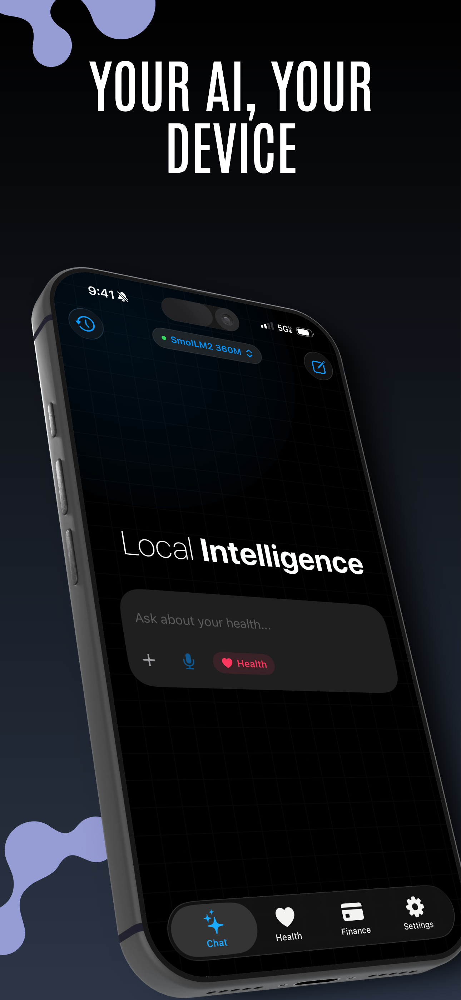
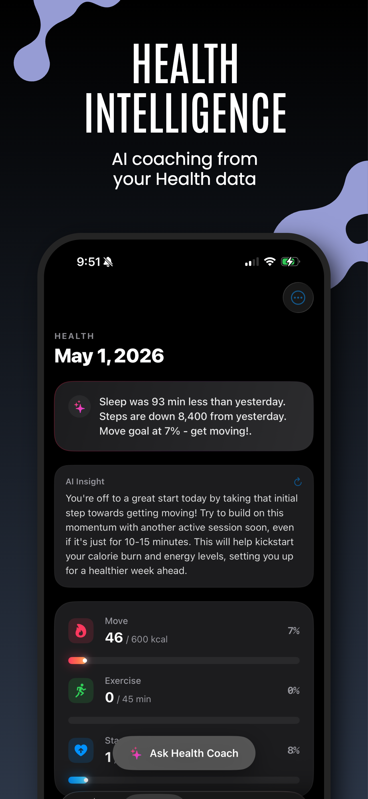
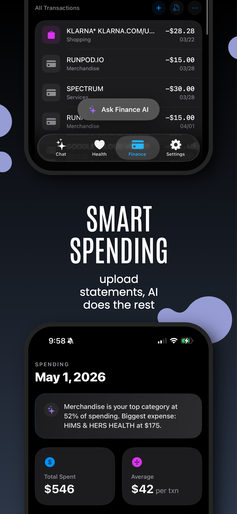
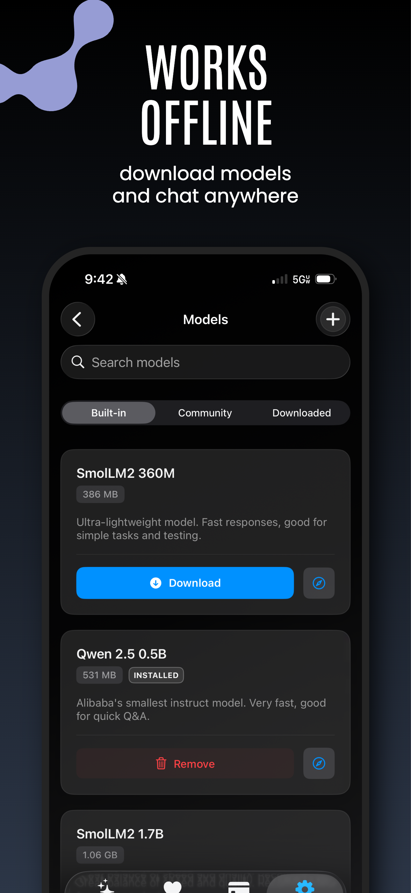
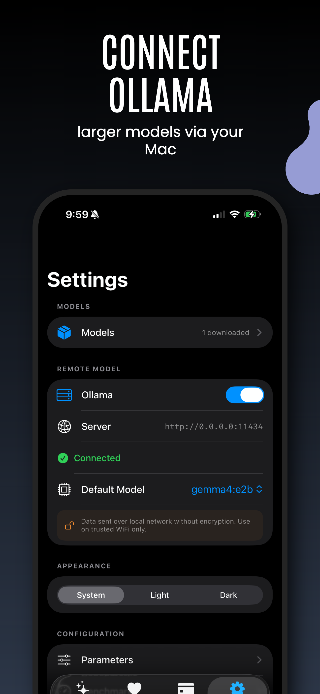

# Priv AI (LocalLLM)

Private AI assistant that runs entirely on your device. No cloud, no accounts, no tracking.

<p align="center">
  <a href="https://apps.apple.com/us/app/priv-ai/id6765706001">
    
  </a>
</p>

<p align="center">
  
  
  
  
  
</p>

## What it does

- **Chat** with AI models downloaded to your device
- **Experimental: a 35-billion-parameter model on your iPhone.** Qwen 3.6 35B streams its weights from storage instead of loading into memory, so it runs in about 2.5 GB of RAM. Find it in Settings under Experimental Models. This ships in the newest app version, which may still be in App Store review; if you do not see it yet, check back in a couple of days.
- **Health insights** from Apple HealthKit data with AI coaching
- **Finance tracking** from uploaded bank/credit card statements (PDF or image)
- **Image analysis** via on-device OCR
- **Ollama support** for connecting to larger models on your Mac over local WiFi

Everything stays on your device. The app works offline after you download a model.

## How it works

Regular models run through [llama.cpp](https://github.com/ggerganov/llama.cpp) using GGUF format. The app includes a catalog of models from Hugging Face (SmolLM2, Qwen2.5, Llama 3.2, Phi 3.5, Gemma, Mistral) ranging from 360M to 7B parameters.

The experimental 35B runs on Swiftlet, a Swift + Metal engine that keeps a small dense core resident and streams the model's Mixture-of-Experts weights from storage per token. The model itself comes from [Hugging Face](https://huggingface.co/Leonickson/Qwen3.6-35B-A3B-qpack) as a resumable in-app download of about 18 GB.

For health and finance features, the app uses Apple's on-device frameworks (HealthKit, Vision OCR, PDFKit) to gather data, then feeds it as context to the LLM for analysis.

## Building from source

### Requirements

- macOS 14+ (Sonoma or later)
- Xcode 16+
- Physical iOS device running iOS 17+ (simulator works for UI but not HealthKit/inference)
- Apple Developer account (free tier works for personal device testing)

### Steps

```bash
# 1. Clone the app and the Swiftlet engine side by side
#    (the project references ../swiftlet as a local package)
git clone https://github.com/leonickson1/localLLM.git
git clone https://github.com/leonickson1/Swiftlet.git swiftlet
cd localLLM

# 2. Open in Xcode
open localLLM.xcodeproj
```

3. Wait for SPM to resolve the [llama.swift](https://github.com/mattt/llama.swift) dependency (takes ~1 min first time)
4. **Change the Bundle Identifier** in Signing & Capabilities. The existing `com.monishsoundarraj.PrivAI` is registered to the original developer's team and Apple will reject it. Use something unique like `com.yourname.PrivAI`
5. **Set your Development Team** in Signing & Capabilities (Xcode will prompt you on first build)
6. Select your iOS device as the run destination (simulator works for UI, but HealthKit and llama.cpp inference need a real device)
7. Hit **Cmd+R** to build and run
8. On first launch, accept the terms screen and download a model from the built-in catalog

> **Apple Developer account note:** A free account is fine for running it on your own device. HealthKit capability works on free accounts for personal builds, you don't need the paid $99/yr program unless you want to distribute via TestFlight or the App Store.

### Troubleshooting

| Issue | Fix |
|-------|-----|
| `Failed to register bundle identifier` | Change `PRODUCT_BUNDLE_IDENTIFIER` to a unique value (e.g. `com.yourname.PrivAI`) in Signing & Capabilities |
| `No account for team` / signing failed | In Signing & Capabilities, click the Team dropdown and pick yours. Add your Apple ID via Xcode → Settings → Accounts if it's not listed |
| SPM package fails to resolve | Xcode menu: File > Packages > Reset Package Caches |
| HealthKit entitlement error | Ensure `localLLM.entitlements` has HealthKit enabled and your provisioning profile supports it. On free accounts, HealthKit still works for personal builds |
| "No such module LlamaSwift" | Clean build folder (Cmd+Shift+K), then rebuild |
| Model download stuck | Check WiFi connection. Downloads are large (360MB - 4GB) |

### Ollama (optional)

For better results with larger models, run Ollama on your Mac:

```bash
OLLAMA_HOST=0.0.0.0:11434 ollama serve
```

Then connect from Settings in the app using your Mac's local IP (e.g. `192.168.1.100:11434`). Your phone and Mac must be on the same WiFi network.

## Architecture

| Layer | Tech |
|-------|------|
| Inference | llama.cpp via [llama.swift](https://github.com/mattt/llama.swift) |
| Streamed 35B (experimental) | Swiftlet, Swift + Metal Mixture-of-Experts streaming |
| Health | HealthKit |
| Finance | PDFKit + Vision OCR + LLM categorization |
| Remote models | Ollama REST API |
| Storage | UserDefaults (sandboxed, on-device) |
| UI | SwiftUI |

## Privacy

- No data leaves your device (unless you connect Ollama over local WiFi)
- No accounts, no telemetry, no analytics
- Health data queried live from HealthKit, not cached
- Financial data stored in app sandbox, inaccessible to other apps
- All inference runs on-device via llama.cpp

## Contributing

Pull requests welcome. Please keep the privacy-first approach - no cloud dependencies, no tracking, no analytics.

### Areas where help is needed

- **Finance extraction accuracy** - Better parsing for different bank statement formats (Chase, Amex, Citi, etc.)
- **Model recommendations** - Testing which GGUF models work best for different tasks on-device
- **Accessibility** - VoiceOver support, Dynamic Type
- **Localization** - Multi-language support for UI and prompts
- **Testing** - Unit tests, UI tests, edge case coverage
- **Documentation** - In-app help, user guide

### Feature ideas

- Workout plan generation from health data
- Budget goals and alerts
- Export data (CSV, PDF reports)
- Widget for health summary
- Siri Shortcuts integration
- More statement format support

## Acknowledgments

Initial inspiration came from [Google AI Edge Gallery](https://github.com/google-ai-edge/gallery), which showed what on-device LLM inference can feel like as a polished consumer app. This project takes that idea in an Apple-platform direction with HealthKit, PDF/Vision finance parsing, and Ollama bridging.

Built on top of:

- [llama.cpp](https://github.com/ggerganov/llama.cpp): inference engine
- [llama.swift](https://github.com/mattt/llama.swift): Swift bindings
- Hugging Face: GGUF model hosting (SmolLM2, Qwen2.5, Llama 3.2, Phi 3.5, Gemma, Mistral)
- Apple frameworks: HealthKit, Vision, PDFKit, SwiftUI

## License

GPL-3.0 - see [LICENSE](LICENSE)
